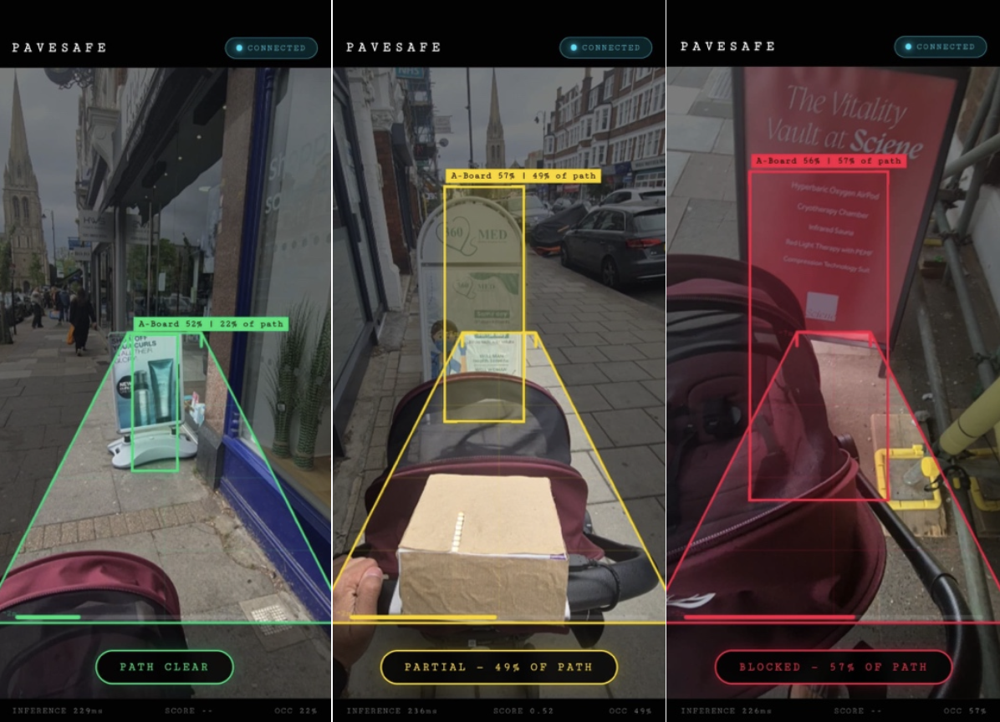
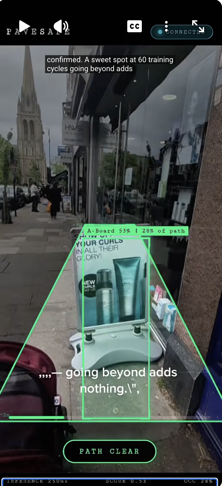

# PaveSafe — Real-Time A-Board Pavement Obstruction Detection



> TinyML-powered pedestrian accessibility tool detecting A-frame advertising boards on London pavements in real time — no cloud required.

**Gilang Pamungkas**
MSc Connected Environments — CASA0018 Deep Learning for Sensor Networks
University College London (UCL CASA)

---

## Overview

A-frame advertising boards (A-boards) frequently obstruct London pavements, creating accessibility barriers for wheelchair users, pushchair users, and elderly pedestrians. PaveSafe is an Android application that uses on-device machine learning to detect A-boards in real time, calculate how much of the pavement they block, and alert the user via a physical Arduino NeoPixel LED strip.

The full pipeline runs entirely on a Samsung Galaxy S24 FE — no internet or cloud dependency required.

---

## Demo Video

[](https://youtube.com/shorts/1hkJpSCanuM?si=L4-rOiVmYBlApgO1)

---

## System Pipeline

```
Camera (Samsung S24 FE)
    → SSD MobileNetV2 FPN-Lite (WebAssembly, ~280ms)
        → Occupancy Calculation (Trapezoid ROI)
            → Visual Overlay (Bounding box + status banner)
            → Arduino LED Alert (Green / Amber / Red)
```

---

## Hardware

| Component | Details |
|---|---|
| Mobile device | Samsung Galaxy S24 FE (Android 16) |
| Microcontroller | Arduino MKR WiFi 1010 |
| LED actuator | NeoPixel 8-stick, pin 6 |
| Communication | HTTP over WiFi (phone hotspot) |

---

## Models

Two architectures were trained and evaluated:

| Architecture | Accuracy | Inference | Flash |
|---|---|---|---|
| FOMO MobileNetV2 0.35 | F1: 88.0% | 4ms | 81.1KB |
| SSD MobileNetV2 FPN-Lite | mAP@50: 0.74 | ~280ms | 3.3MB |

SSD is used for live deployment (accurate bounding boxes for occupancy calculation).
FOMO is documented as the optimal architecture for constrained/MCU deployment.

**Edge Impulse Projects:**
- FOMO: https://studio.edgeimpulse.com/public/974677/live
- SSD: https://studio.edgeimpulse.com/public/967358/live

---

## Dataset

200 base images self-captured across North London, augmented to 480 training images via Roboflow. Single class: `a-board`.

**Collection locations:**
- East Finchley High Road
- Tally Ho Corner, North Finchley
- Muswell Hill Broadway
- Oxford Street / Leicester Square (Google Street View)

**Roboflow dataset:** https://app.roboflow.com/gilangs-workspace-yzow7/a-board-detector/11

**Conditions covered:** Day/night · Close/far · Straight-on/angled · Chalkboard/printed/illuminated

---

## Repository Structure

```
├── README.md                       # This file — all project info in one place
│
├── app/
│   ├── pavesafe.html               # Main app — WebAssembly inference + UI
│   ├── edge-impulse-standalone.js  # Edge Impulse WASM SDK
│   ├── run-impulse.js              # Edge Impulse runner
│   └── MainActivity.kt             # Android WebView wrapper + Arduino bridge
│
├── arduino/
│   └── pavesafe_arduino.ino        # Arduino MKR WiFi 1010 sketch
│
└── img/
  
```

---

## Setup Instructions

### Prerequisites

- Android device (Android 9+)
- Arduino MKR WiFi 1010
- Adafruit NeoPixel 8-stick
- Android Studio or Gradle
- Arduino IDE with `WiFiNINA` and `Adafruit_NeoPixel` libraries installed

### 1. Arduino Setup

1. Wire NeoPixel: `5V → 5V` · `GND → GND` · `DIN → Pin 6`
2. Open `arduino/pavesafe_arduino.ino` in Arduino IDE
3. Update WiFi credentials if needed:

```cpp
const char* SSID     = "YourHotspot";
const char* PASSWORD = "YourPassword";
```

4. Upload to Arduino MKR WiFi 1010
5. Enable phone hotspot — note the Arduino IP from Serial Monitor (115200 baud)

### 2. App Setup

1. Update Arduino IP in `app/MainActivity.kt`:

```kotlin
private val ARDUINO_IP = "YOUR_ARDUINO_IP"
```

2. Download WebAssembly model from Edge Impulse and place files in `app/`
3. Build and install APK:

```bash
gradle installDebug
```

### 3. Running

1. Enable phone hotspot named **"Gilang"** (or your configured SSID)
2. Power Arduino — wait for **3 green flashes** (connected)
3. Open PaveSafe app on phone
4. Hold phone at chest height (~1.4m), screen facing forward
5. Walk toward A-boards — detection triggers automatically

---

## Status Indicators

| Status | Occupancy | App Banner | LED |
|---|---|---|---|
| Scanning | — | SCANNING... | Cyan breathing |
| Clear | < 25% | PATH CLEAR | Steady green |
| Partial | 25–50% | PARTIAL — X% OF PATH | Amber pulse |
| Blocked | > 50% | BLOCKED — X% OF PATH | Red fast blink |

---

## Key Findings

- **Data augmentation** was the dominant FOMO performance driver (+35.4% F1 combined)
- **Double augmentation** (Roboflow + Edge Impulse on-the-fly) eliminated overfitting completely
- **SSD sweet spot**: 60 cycles, LR 0.001 — no improvement beyond this
- **mAP@50 vs mAP@75 gap** (0.74 → 0.41) reveals inherent localisation imprecision
- **Benchmark metrics ≠ deployment suitability**: FOMO wins on speed, SSD wins on occupancy accuracy

---

## Limitations

- Single class, single city — generalisation to other obstruction types untested
- Dataset biased toward trading hours — closed/night deployment not represented
- Bounding box precision constrained by 480-image dataset size
- ~280ms SSD inference limits responsiveness compared to FOMO's 4ms

---

## Future Work

- Extend class taxonomy: cones, barriers, scaffolding
- Incorporate negative examples (clear pavements) to reduce false positives
- Explore model distillation to improve SSD inference speed on mobile

---

## Links

| Resource | Link |
|---|---|
| GitHub | https://github.com/gilangpamungkas/casa0018_a_board_detector |
| Roboflow Dataset | https://app.roboflow.com/gilangs-workspace-yzow7/a-board-detector/11 |
| Edge Impulse (FOMO) | https://studio.edgeimpulse.com/public/974677/live |
| Edge Impulse (SSD) | https://studio.edgeimpulse.com/public/967358/live |

---

## Acknowledgements

Built with [Edge Impulse](https://edgeimpulse.com), [Roboflow](https://roboflow.com), and [Adafruit NeoPixel](https://github.com/adafruit/Adafruit_NeoPixel).

---

## License

MIT License — see [LICENSE](LICENSE) for details.
